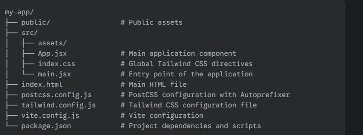

# create-react-tw 🚀

<p align="center">
  
  
  
</p>

### ✨ The easiest way to create a Vite + React + Tailwind CSS v4 project.

`create-react-tw` is a zero-configuration, one-command CLI that bootstraps a modern web project with a pre-configured stack. Stop wasting time on boilerplate setup and start building your application instantly.

This tool sets up a complete development environment with:
- ⚡ **Vite**: For a lightning-fast development server and build system.
- ⚛️ **React**: A popular JavaScript library for building user interfaces.
- 🎨 **Tailwind CSS v4**: The latest version of the utility-first CSS framework.
- 📘 **TypeScript / JavaScript**: Choose your preferred language.
- 🔧 **PostCSS & Autoprefixer**: For seamless CSS processing.

---

## 🚀 Getting Started

### Prerequisites

You need to have [Node.js](https://nodejs.org/en/) (version 14 or higher) and `npm` installed on your system.

### Installation & Usage

Run the following command in your terminal to create a new project. Replace `my-app` with your desired project name.

```sh
npx create-react-tw my-app


The interactive CLI will then guide you through the setup:

? Select framework: React
? Select variant: JavaScript / TypeScript


Starting Development
Navigate to your new project directory and run the following commands to install dependencies and start the development server.

cd my-app
npm install
npm run dev


Your new application will be running at http://localhost:5173.


The README.md you've provided is already quite good, but we can definitely enhance it to be more professional and informative for an NPM audience. Here are some suggestions and a revised version that incorporates them:

Key Improvements:
More Engaging Heading: Start with a strong, clear statement of purpose.

Clearer "Why" Statement: Briefly explain why someone should use this tool instead of setting up a project manually. Highlight the pain points it solves.

Refined Features List: Use clearer, more benefit-oriented language. For example, "Pre-configured PostCSS" is good, but "PostCSS Integration" sounds more professional.

Improved Installation Section:

Add a clear "Prerequisites" section (e.g., Node.js and npm).

Break down the installation and "getting started" process into numbered steps. This makes it much easier to follow.

Use code blocks with language hints (sh for shell) for better syntax highlighting.

Add an example of the CLI interaction to show users what to expect.

Refined "What's Inside" Section:

Use a more descriptive title like "Key Technologies" or "Pre-configured Stack."

Present the list in a more structured way, perhaps with brief explanations.

Better Project Structure Visualization:

The current tree view is good, but a cleaner, more readable format is better.

Explain the purpose of some of the key files (e.g., tailwind.config.js).

Contribution Section:

This is crucial for an open-source project. Encourage users to contribute, report bugs, or suggest features. This builds a community around your tool.

Credits/Acknowledgements: If you've been inspired by other projects or used external code, it's good practice to acknowledge them.

Consistent Formatting: Ensure headings, bold text, and code blocks are used consistently to improve readability.

Revised README.md
Markdown

# create-react-tw 🚀

<p align="center">
  
  
  
</p>

### ✨ The easiest way to create a Vite + React + Tailwind CSS v4 project.

`create-react-tw` is a zero-configuration, one-command CLI that bootstraps a modern web project with a pre-configured stack. Stop wasting time on boilerplate setup and start building your application instantly.

This tool sets up a complete development environment with:
- ⚡ **Vite**: For a lightning-fast development server and build system.
- ⚛️ **React**: A popular JavaScript library for building user interfaces.
- 🎨 **Tailwind CSS v4**: The latest version of the utility-first CSS framework.
- 📘 **TypeScript / JavaScript**: Choose your preferred language.
- 🔧 **PostCSS & Autoprefixer**: For seamless CSS processing.

---

## 🚀 Getting Started

### Prerequisites

You need to have [Node.js](https://nodejs.org/en/) (version 14 or higher) and `npm` installed on your system.

### Installation & Usage

Run the following command in your terminal to create a new project. Replace `my-app` with your desired project name.

```sh
npx create-react-tw my-app
The interactive CLI will then guide you through the setup:

? Select framework: React
? Select variant: JavaScript / TypeScript
Starting Development
Navigate to your new project directory and run the following commands to install dependencies and start the development server.

Bash

cd my-app
npm install
npm run dev
Your new application will be running at http://localhost:5173.

📂 Project Structure
create-react-tw sets up a clean, organized project structure designed for a great developer experience.




(Note: .tsx and .ts files will be used if you select TypeScript.)

⚙️ Key Technologies
Vite: A next-generation frontend tool that provides a fast development experience.

React: A declarative, component-based library for building user interfaces.

Tailwind CSS v4: A highly efficient utility-first CSS framework.

PostCSS: A tool for transforming CSS with JavaScript plugins.

TypeScript: An optional, strongly-typed superset of JavaScript that compiles to plain JavaScript.


📄 License
This project is licensed under the MIT License.

MIT © Sujal Jindal